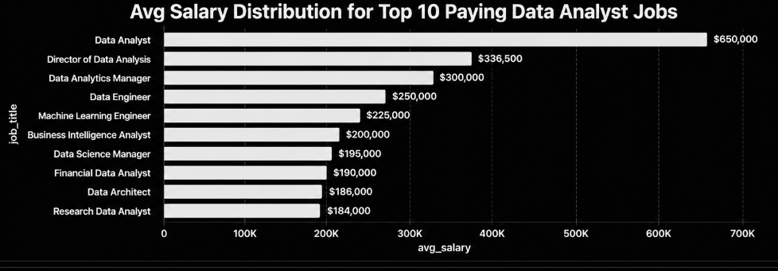
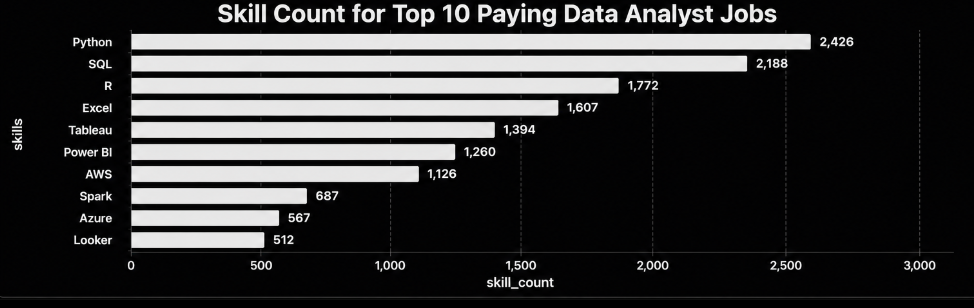

# 📊 Introduction

This project was completed as part of Luke Barousse's SQL for Data Analytics course, where I applied SQL to analyze a real-world dataset of data analyst job postings.

Throughout the project, I explored the data job market by writing SQL queries to identify top-paying data analyst roles, the skills employers value most, the most in-demand technologies, and the relationship between skill demand and salary.

Working through this project helped me strengthen my understanding of SQL while gaining hands-on experience with data exploration, filtering, joins, aggregation, Common Table Expressions (CTEs), and real-world business analysis.

🔎 **SQL queries can be found here:** [`project_sql`](./project_sql/)

# 📌 Background

The demand for data analysts continues to grow across industries, making it valuable to understand which skills are most sought after and how they relate to salary opportunities. By analyzing real-world job posting data, this project explores trends within the data analyst job market using SQL.

The analysis is centered around answering five key business questions:

1. 💰 What are the highest-paying Data Analyst jobs?
2. 🛠️ What skills are required for the highest-paying Data Analyst jobs?
3. 📈 What are the most in-demand skills for Data Analysts?
4. 💵 Which skills are associated with the highest average salaries?
5. 🎯 What are the most optimal skills based on both demand and salary?

These questions are answered through SQL queries using techniques such as joins, aggregate functions, filtering, sorting, and Common Table Expressions (CTEs), transforming raw job posting data into meaningful business insights.

# 🛠️ Tools I Used

Throughout this project, I used the following tools to query, analyze, and manage the data:

- **SQL** – Used to write queries that explored the dataset and answered the project's business questions.
- **PostgreSQL** – Served as the relational database management system for storing and querying the data.
- **pgAdmin 4** – Used to create the database, execute SQL queries, and manage the PostgreSQL environment.
- **Visual Studio Code** – Used as the primary code editor to write, organize, and manage SQL scripts.
- **Git & GitHub** – Used for version control, tracking project progress, and hosting the completed project repository.

# 📊 The Analysis

This project explores five key business questions using SQL to uncover insights into the Data Analyst job market. Each query builds on different SQL concepts while providing meaningful information about salaries, required skills, and industry demand.

---

# 1️⃣ Top Paying Data Analyst Jobs

### 📌 Business Question

**What are the highest-paying remote Data Analyst jobs?**

To answer this question, I filtered remote Data Analyst positions with available salary information and ranked them by their average annual salary.

### 💻 SQL Query

📂 **View the full query:** [`1_top_paying_jobs.sql`](./project_sql/1_top_paying_jobs.sql)

### 📋 Top 10 Highest Paying Jobs

| Job Title | Company | Average Salary |
|------------|---------|---------------:|
| Data Analyst | Mantys | $650,000 |
| Director of Analytics | Meta | $336,500 |
| Associate Director – Data Insights | AT&T | $255,830 |
| Data Analyst, Marketing | Pinterest | $232,423 |
| Data Analyst (Hybrid/Remote) | UCLA Health | $217,000 |
| Principal Data Analyst | SmartAsset | $205,000 |
| Director, Data Analyst | Inclusively | $189,309 |
| Principal Data Analyst | Motional | $186,000 |
| ERM Data Analyst | Get It Recruit | $184,000 |
| Data Analyst | Uclahealthcareers | $184,000 |

### 📈 Visualization

  

### 🔍 Insights

- The highest-paying Data Analyst role offers an annual salary of **$650,000**.
- Salaries among the top 10 positions range from **$184K to $650K**, demonstrating significant variation in compensation.
- Leadership positions such as **Director of Analytics** and **Principal Data Analyst** appear frequently, suggesting senior-level expertise commands higher salaries.
- Remote Data Analyst roles can offer exceptionally competitive compensation for experienced professionals.

---

# 2️⃣ Skills Required for Top Paying Jobs

### 📌 Business Question

**What skills are required for the highest-paying Data Analyst jobs?**

After identifying the top-paying positions, I joined the job postings with their associated skills to determine which technologies appear most frequently.

### 💻 SQL Query

📂 **View the full query:** [`2_top_paying_job_skills.sql`](./project_sql/2_top_paying_job_skills.sql)

### 📈 Visualization

  

### 🔍 Insights

- **SQL** and **Python** appear most frequently among the highest-paying Data Analyst jobs.
- Employers consistently seek professionals with strong database querying and programming skills.
- Cloud technologies such as **Azure**, **AWS**, and **Databricks** also appear in several high-paying roles.
- Visualization tools including **Tableau** and **Power BI** remain valuable skills for advanced analytics positions.

---

# 3️⃣ Most In-Demand Skills

### 📌 Business Question

**What are the most in-demand skills for Data Analysts?**

This query identifies the skills that appear most frequently across Data Analyst job postings, highlighting the technologies employers value the most.

### 💻 SQL Query

📂 **View the full query:** [`3_top_demanded_skills.sql`](./project_sql/3_top_demanded_skills.sql)

### 📋 Top Skills by Demand

| Skill | Demand Count |
|--------|-------------:|
| SQL | 92,628 |
| Excel | 67,031 |
| Python | 57,326 |
| Tableau | 46,554 |
| Power BI | 39,468 |

### 🔍 Insights

- **SQL** is the most requested skill by a significant margin.
- **Excel** continues to play an important role in data analysis despite the growing popularity of programming languages.
- **Python** remains one of the core technical skills employers expect.
- Visualization platforms such as **Tableau** and **Power BI** are consistently requested across job postings.

---

# 4️⃣ Top Paying Skills

### 📌 Business Question

**Which technical skills are associated with the highest average salaries?**

This analysis calculates the average salary for each skill to determine which technologies provide the highest earning potential.

### 💻 SQL Query

📂 **View the full query:** [`4_top_paying_skills.sql`](./project_sql/4_top_paying_skills.sql)

### 📋 Highest Paying Skills

| Skill | Average Salary |
|--------|---------------:|
| SVN | $400,000 |
| Solidity | $179,000 |
| Couchbase | $160,515 |
| DataRobot | $155,486 |
| Golang | $155,000 |

### 🔍 Insights

- Specialized technologies generally command much higher salaries than common analytics tools.
- Skills such as **Solidity**, **Golang**, and **Couchbase** are associated with premium compensation.
- Advanced technical expertise can significantly increase earning potential.
- High-paying skills often belong to niche areas including software engineering, cloud computing, and machine learning.

---

# 5️⃣ Optimal Skills to Learn

### 📌 Business Question

**Which skills provide the best combination of demand and salary?**

This final analysis combines salary data with employer demand to identify the most valuable skills for aspiring Data Analysts.

### 💻 SQL Query

📂 **View the full query:** [`5_optimal_skills.sql`](./project_sql/5_optimal_skills.sql)

### 📋 Top Optimal Skills

| Skill | Demand Count | Average Salary |
|--------|-------------:|---------------:|
| Go | 27 | $115,320 |
| Confluence | 11 | $114,210 |
| Hadoop | 22 | $113,193 |
| Snowflake | 37 | $112,948 |
| Azure | 34 | $111,225 |

### 🔍 Insights

- **Snowflake** and **Azure** provide an excellent balance of strong demand and competitive salaries.
- **Go** offers the highest average salary among the optimal skills identified.
- Cloud platforms and big data technologies continue to be valuable investments for career growth.
- Developing expertise in both traditional analytics tools and modern cloud technologies creates the strongest long-term career opportunities.

# 💡 What I Learned

Completing this project helped me strengthen both my SQL skills and my understanding of how data can be used to answer real-world business questions. Throughout the analysis, I gained hands-on experience with:

- Writing complex SQL queries using JOINs, Common Table Expressions (CTEs), subqueries, and aggregate functions.
- Applying filtering, sorting, and grouping techniques to extract meaningful insights from large datasets.
- Analyzing salary trends and identifying the relationship between technical skills, employer demand, and compensation.
- Structuring SQL queries to solve practical business problems rather than simply retrieving data.
- Organizing SQL projects using **Git** & **GitHub** to create a well-documented, portfolio-ready repository.

This project also reinforced the importance of presenting technical findings in a clear and structured way, making the analysis easier to understand for both technical and non-technical audiences.

---

# 🎯 Conclusion

This project provided valuable hands-on experience in using SQL to analyze real-world job market data and answer meaningful business questions. By exploring salary trends, identifying the most in-demand skills, and evaluating the relationship between skill demand and compensation, I gained practical insights into the current Data Analyst job market.

Beyond strengthening my SQL knowledge, this project improved my ability to approach data analytically, communicate findings effectively, and document a complete data analysis project from start to finish. It also provided a strong foundation for tackling more advanced analytics projects using SQL, data visualization, and business intelligence tools.